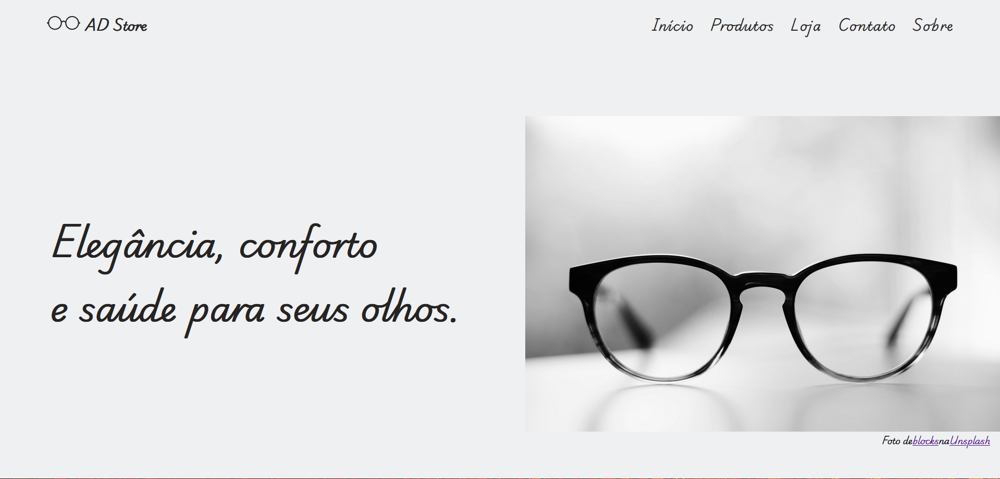
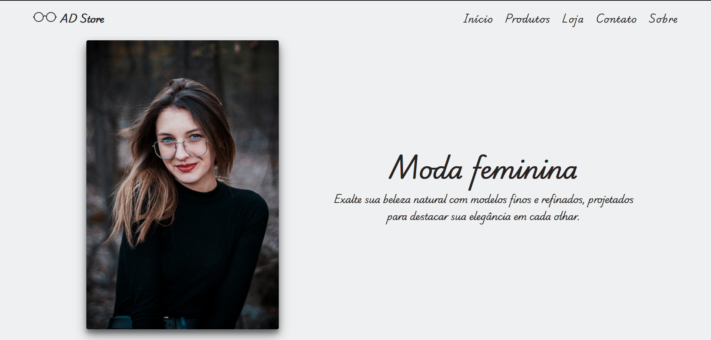
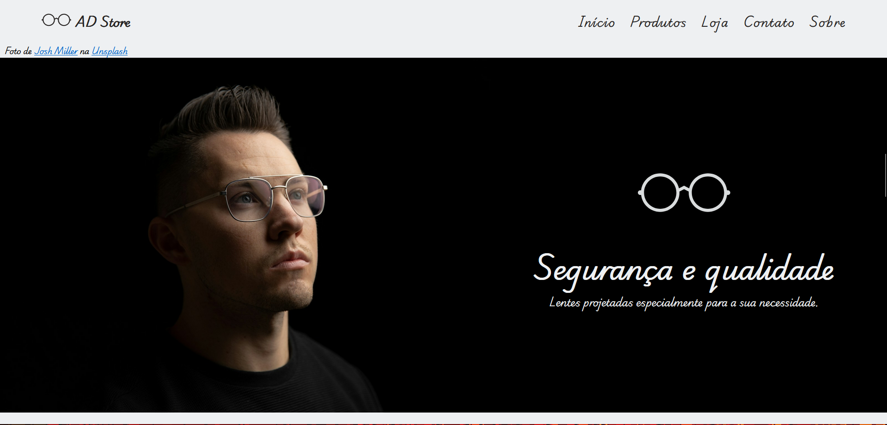

<div align="center">
 
 <h1>Optical Store Landing Page</h1>
 <p>Landing page de uma ótica fictícia.</p>
</div>

# Preview




# Recursos utilizados

Projeto desenvolvido em ```HTML5```, ```CSS3```, ```JavaScript``` e imagens do ```Unsplash```(créditos das imagens devidamente informados na versão desktop) que simula uma loja comercial de venda de óculos. O site exibe imagens ilustrativas de modelos, especialidades da ótica, modelos que estão disponíveis para venda, localização, entre outras informações.
