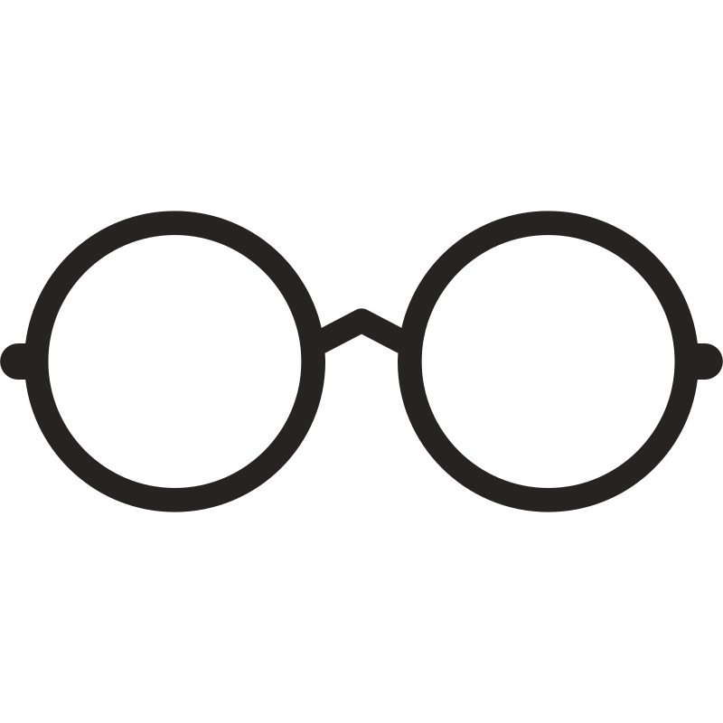
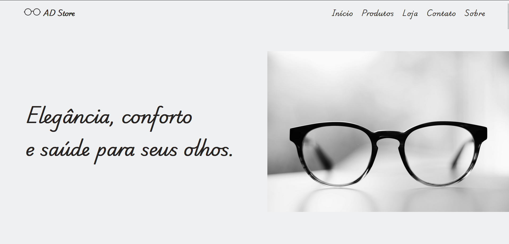
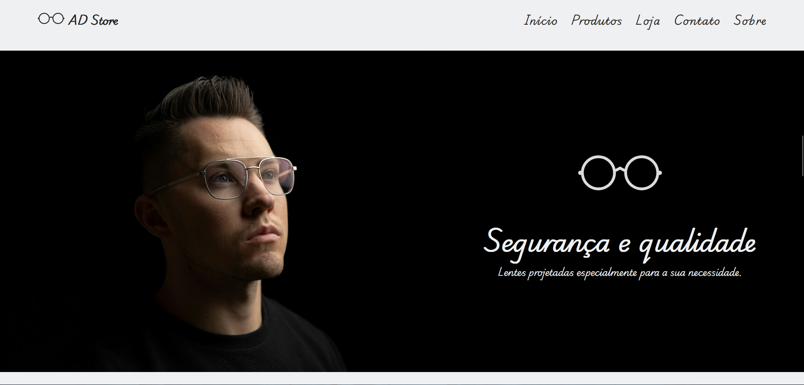

<div align="center">
 
</div>


<div align="center">
 <h1>Optical Store Landing Page</h1>
 <p>Landing page de uma ótica fictícia.</p>
</div>

## Showcase




## Recursos utilizados

Projeto desenvolvido em ```HTML5```, ```CSS3``` e ```JavaScript```, API do ```Leaflet``` para exibição do mapa e imagens do ```Unsplash``` que simula um site comercial de uma ótica.
